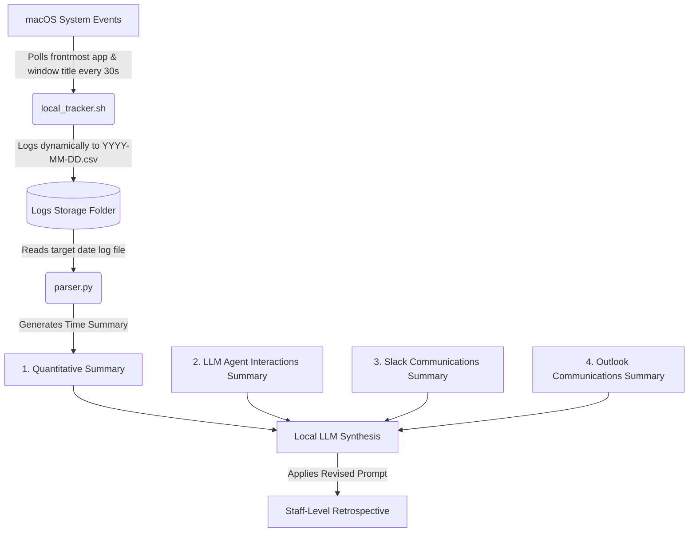

# Private Air-Gapped Time-Tracking System
## Architectural & Implementation Specification

This specification outlines the architecture, configuration, and operation of a 100% private, air-gapped time-tracking system designed for environments with strict corporate info-sec constraints. 

By splitting the task into deterministic data collection (Bash/AppleScript), lightweight mathematical aggregation (Python/Pandas), and qualitative semantic analysis (local LLM), this system ensures that sensitive activity metrics never leave your local workspace.

---

## 🏗️ System Architecture



### Key Highlights
* **Zero Data Exfiltration**: Runs completely within the local CPU/GPU and storage boundaries. No external network requests are made.
* **Deterministic Arithmetic**: Offloads statistical aggregation to Python/Pandas instead of relying on the LLM's weak arithmetic capabilities.
* **Defined Storage Path**: Daily logs are stored in a dedicated folder: `/Users/neerav/Documents/Projects/time_tracker/daily_log`.
* **Daily Log Rotation**: The logging script dynamically switches to a new file named `YYYY-MM-DD.csv` at midnight, eliminating the need for a separate log rotation daemon.
* **Cross-Reference Capability**: Synthesizes passive activity logging with qualitative communication & research summaries to evaluate Staff-level impact versus low-level busywork.
* **Minimal Resource Footprint**: The background bash tracker sleeps between polls, consuming near-zero CPU cycles.

---

## 🛠️ Implementation Details & Code Reference

To implement this system, create the following files in your preferred local environment directory.

### 1. Passive macOS Window Capture (`local_tracker.sh`)
This background shell script polls macOS system events every 30 seconds to capture the active application, window title, and active browser tab URL. It dynamically creates and writes to a new log file named after the current date (`YYYY-MM-DD.csv`).

```bash
#!/bin/zsh

# Configurable polling interval in seconds
POLL_INTERVAL=30

# DEFINED STORAGE PATH: Directory where daily log CSVs are stored
LOG_DIR="/Users/neerav/Documents/Projects/time_tracker/daily_log"

# Ensure the log directory exists
mkdir -p "$LOG_DIR"

echo "Starting passive macOS Window Tracker (polling every ${POLL_INTERVAL}s)..."
echo "Daily logs will be written to: $LOG_DIR"
echo "Press Ctrl+C to stop (if running in foreground)."

while true; do
    # Dynamically determine the log file name based on the current date (e.g. 2026-05-24.csv)
    CURRENT_DATE=$(date +"%Y-%m-%d")
    LOG_FILE="$LOG_DIR/${CURRENT_DATE}.csv"
    
    # Initialize CSV header only if the file doesn't already exist
    if [ ! -f "$LOG_FILE" ]; then
        echo "Timestamp,Application,WindowTitle,URL" > "$LOG_FILE"
    fi

    # Capture frontmost app name and window title via AppleScript (always compiles cleanly)
    APP_INFO=$(osascript -e '
        tell application "System Events"
            set frontApp to first application process whose frontmost is true
            set appName to name of frontApp
            try
                tell frontApp to set winName to name of first window
            on error
                set winName to "No Active Window"
            end try
            return appName & "%%" & winName
        end tell' 2>/dev/null)

    if [ ! -z "$APP_INFO" ]; then
        TIMESTAMP=$(date +"%Y-%m-%d %H:%M:%S")
        
        # Split the string by the delimiter
        APP_NAME=$(echo "$APP_INFO" | awk -F '%%' '{print $1}')
        WIN_TITLE=$(echo "$APP_INFO" | awk -F '%%' '{print $2}')
        
        # Skip logging lock screen, login window, and screensaver events
        if [[ "$APP_NAME" == "loginwindow" || "$APP_NAME" == "ScreenSaverEngine" || "$APP_NAME" == "SecurityAgent" ]]; then
            sleep "$POLL_INTERVAL"
            continue
        fi
        
        # Capture active tab URL dynamically depending on the active browser
        TAB_URL="N/A"
        if [ "$APP_NAME" = "Google Chrome" ]; then
            TAB_URL=$(osascript -e 'tell application "Google Chrome" to get URL of active tab of front window' 2>/dev/null)
        elif [ "$APP_NAME" = "Safari" ]; then
            TAB_URL=$(osascript -e 'tell application "Safari" to get URL of current tab of front window' 2>/dev/null)
        elif [ "$APP_NAME" = "Arc" ]; then
            TAB_URL=$(osascript -e 'tell application "Arc" to get URL of active tab of front window' 2>/dev/null)
        elif [ "$APP_NAME" = "Brave Browser" ]; then
            TAB_URL=$(osascript -e 'tell application "Brave Browser" to get URL of active tab of front window' 2>/dev/null)
        elif [ "$APP_NAME" = "Microsoft Edge" ]; then
            TAB_URL=$(osascript -e 'tell application "Microsoft Edge" to get URL of active tab of front window' 2>/dev/null)
        fi
        
        # Default empty/null URL to N/A
        if [ -z "$TAB_URL" ]; then
            TAB_URL="N/A"
        fi
        
        # Sanitize double quotes for clean CSV writing (double quote escaping)
        APP_NAME="${APP_NAME//\"/\"\"}"
        WIN_TITLE="${WIN_TITLE//\"/\"\"}"
        TAB_URL="${TAB_URL//\"/\"\"}"

        # Append structured row to the CSV log file
        echo "\"$TIMESTAMP\",\"$APP_NAME\",\"$WIN_TITLE\",\"$TAB_URL\"" >> "$LOG_FILE"
    fi
    
    sleep "$POLL_INTERVAL"
done
```

---

### 2. Deterministic Aggregator (`parser.py`)
This Python script aggregates a target date's log file. It defaults to analyzing today's logs, but accepts a specific date (format: `YYYY-MM-DD`) as a command-line argument.

```python
import os
import sys
import datetime
from urllib.parse import urlparse
import pandas as pd

# DEFINED STORAGE PATH: Directory where daily log CSVs are stored
LOG_DIR = "/Users/neerav/Documents/Projects/time_tracker/daily_log"

# Polling interval in seconds used in local_tracker.sh
# 30 seconds = 0.5 minutes per record
POLL_INTERVAL_SECONDS = 30
MINUTES_PER_RECORD = POLL_INTERVAL_SECONDS / 60.0

def extract_domain(url):
    if not isinstance(url, str) or pd.isna(url) or url.strip() in ('N/A', ''):
        return 'N/A'
    try:
        # Prepend scheme if missing (e.g. "github.com" instead of "https://github.com")
        if not url.startswith(('http://', 'https://', 'file://', 'chrome://', 'about:')):
            url = 'https://' + url
        parsed = urlparse(url)
        domain = parsed.netloc
        if domain.startswith('www.'):
            domain = domain[4:]
        return domain if domain else 'N/A'
    except Exception:
        return 'N/A'

def main():
    # Default to today's date, or use the date specified via command-line argument
    if len(sys.argv) > 1:
        target_date = sys.argv[1]
    else:
        target_date = datetime.date.today().strftime("%Y-%m-%d")

    log_file = os.path.join(LOG_DIR, f"{target_date}.csv")

    if not os.path.exists(log_file):
        print(f"Error: Log file for date '{target_date}' not found at {log_file}", file=sys.stderr)
        print("Please check that the date is correct and the tracker is running.", file=sys.stderr)
        sys.exit(1)

    try:
        df = pd.read_csv(log_file)
    except pd.errors.EmptyDataError:
        print(f"Warning: The log file {log_file} is empty. No data to parse.", file=sys.stderr)
        sys.exit(0)
    except Exception as e:
        print(f"Error reading {log_file}: {e}", file=sys.stderr)
        sys.exit(1)

    if df.empty:
        print(f"No log data recorded for {target_date} yet. Please run the tracker for a few minutes first.")
        sys.exit(0)

    # Clean column names in case of leading/trailing whitespace
    df.columns = df.columns.str.strip()

    # Backwards-compatibility for older CSV schemas without URL column
    if 'URL' not in df.columns:
        df['URL'] = 'N/A'

    # Calculate minutes spent for each entry
    df['Minutes'] = MINUTES_PER_RECORD

    # Filter out lock screen, login window, and screensaver events (historical/fallback check)
    lock_screen_apps = ['loginwindow', 'ScreenSaverEngine', 'SecurityAgent']
    df = df[~df['Application'].isin(lock_screen_apps)]

    # Extract domains for browsers
    df['Domain'] = df['URL'].apply(extract_domain)

    # Aggregate time spent per application
    app_summary = df.groupby('Application')['Minutes'].sum().sort_values(ascending=False)

    # Aggregate time spent per browser domain (filtering out non-browser or N/A URLs)
    browser_df = df[df['Domain'] != 'N/A']
    domain_summary = browser_df.groupby('Domain')['Minutes'].sum().sort_values(ascending=False).head(10)

    # Isolate deep-dive window details for context (e.g., top Slack channels or IDE files)
    top_windows = df.groupby(['Application', 'WindowTitle'])['Minutes'].sum().reset_index()
    top_windows = top_windows.sort_values(by='Minutes', ascending=False).head(20)

    # Format the outputs nicely
    print("=" * 45)
    print(f"=== DAILY TIME BREAKDOWN FOR {target_date} ===")
    print("=" * 45)
    print(app_summary.to_string())
    
    if not domain_summary.empty:
        print("\n" + "=" * 45)
        print("=== TOP WEB DOMAINS (MINUTES) ===")
        print("=" * 45)
        print(domain_summary.to_string())

    print("\n" + "=" * 45)
    print("=== TOP SPECIFIC CONTEXTS ===")
    print("=" * 45)
    print(top_windows.to_string(index=False))

if __name__ == "__main__":
    main()
```

---

### 3. Local LLM Context Synthesis Prompt
Use this template in your local LLM engine. Paste the stdout from `parser.py` alongside your other qualitative daily summaries.

```text
# SYSTEM INSTRUCTIONS
You are an executive engineering coach specializing in the productivity and career growth of Staff-level Data Engineers. You are highly analytical, direct, and focused on maximizing architectural impact over busywork.

# INPUT DATA
Review the attached files capturing my workday. Cross-reference the quantitative time data with the qualitative summaries of my communications and research. The attachments include:
1. A quantitative time-tracking summary.
2. A summary of my LLM agent interactions.
3. A summary of my Slack communications.
4. A summary of my Outlook communications.

# OUTPUT REQUIREMENTS
Based strictly on the data in the attached files, generate an end-of-day retrospective. Do not include conversational filler or introductory text. Output in standard Markdown using the following structure:

## 1. Context & Focus Analysis
Synthesize the time-tracking data with my actual outputs. Did my deep-work time (IDEs, LLM research) produce meaningful architectural progress? Cross-reference my Slack and Outlook time with the actual messages sent—was this time spent on Staff-level unblocking, mentoring, and system design, or was it hijacked by reactive, low-level troubleshooting? 

## 2. The Eisenhower Mapping
Map my actual deliverables, communications, and research topics against the Eisenhower Matrix.
*   **Urgent & Important:** Critical path unblocking, production incidents, key architectural decisions made today.
*   **Important but Not Urgent:** Deep system design, LLM research, strategic code refactoring, and documentation.
*   **Urgent but Not Important:** Routine Slack threads, ad-hoc questions, and standard emails.
*   **Not Urgent & Not Important:** Pure friction, context switching, unrelated browsing.

## 3. Tomorrow's Standup Update
Draft a concise, 3-bullet standup update summarizing today's actual focus. Use the qualitative summaries (Slack, Outlook, LLM interactions) to specify exactly what was researched or resolved. Use strong, Staff-level action verbs (e.g., architected, synthesized, unblocked, decoupled, orchestrated). Focus on the business and technical impact of the work.
```

---

## 🚀 Setup & Execution Guide

### Step 1: Running the Logger
1. Save the shell script code as `local_tracker.sh`.
2. Grant execute permissions in the terminal:
   ```bash
   chmod +x local_tracker.sh
   ```
3. Run the tracker in the background:
   ```bash
   nohup zsh local_tracker.sh >/dev/null 2>&1 &
   ```
4. **macOS Security Settings**:
   > [!IMPORTANT]
   > The first time you run this, macOS will ask to grant Terminal **Accessibility** permissions under *System Settings > Privacy & Security > Accessibility*. This is required for AppleScript to query window titles and active browser tabs.

### Step 2: Running the Parser
1. Save the python code as `parser.py`.
2. Ensure you have the `pandas` library installed:
   ```bash
   pip install pandas
   ```
3. Run the script at the end of the day to parse today's logs:
   ```bash
   python parser.py
   ```
4. To parse logs for a previous day, supply the date as an argument:
   ```bash
   python parser.py 2026-05-23
   ```

### Step 3: Performing the Retrospective
Copy the output printed by `parser.py` and supply it alongside your Slack, Outlook, and LLM histories to your local LLM engine using the prompt specified above.

---

## 🔒 Architectural Decisions & Design Notes

### Defined Storage Path & Log Rotation
* **Defined Path**: All logs are saved under `/Users/neerav/Documents/Projects/time_tracker/daily_log` (creating a clear logs folder rather than writing directly to user home or root directories).
* **Automatic Log Rotation**: Every iteration, the script dynamically gets the current date and sets `LOG_FILE="$LOG_DIR/${CURRENT_DATE}.csv"`. When midnight passes, the script automatically begins logging to the new file (e.g. `2026-05-25.csv`), leaving the previous day's log complete and untouched.

### Handling Screen Lock & Sleep States
* **Screen Lock (Mac Awake)**: When the screen is locked but the Mac is awake, macOS makes `loginwindow`, `ScreenSaverEngine`, or `SecurityAgent` the active window context. The system automatically ignores these events:
  * **Logger level**: `local_tracker.sh` skips appending these records to the CSV to avoid log pollution.
  * **Parser level**: `parser.py` filters these application names from historical data as a fallback to keep metrics accurate.
* **Lid Closed (Sleep Mode)**: When you close the lid, macOS suspends all user-space processes (including the shell tracker script). Logging automatically pauses without any CPU consumption, and resumes immediately when you open the lid. No manual start/stop is required at the end of the day.

### Browser Tab Tracking & Domain Extraction
The tracker automatically queries the active browser's window or tab to retrieve the active tab URL.
* **Supported Browsers**: Google Chrome, Safari, Arc, Brave Browser, and Microsoft Edge.
* **Non-Supported Browsers**: Browsers like Firefox do not expose the active URL via standard AppleScript interface and will default the URL capture to `N/A` (while still logging the window title).
* **Domain Aggregation**: The parser automatically extracts the top-level domain from the captured URL (e.g. mapping `https://github.com/pulls` to `github.com`) and reports the **Top Web Domains** visited, making it easy to identify time spent on documentation, reference material, code repositories, or messaging apps.

### Ignoring Specific Applications
If you wish to auto-ignore other apps (e.g., Spotify) so they don't appear in your work log, you can add a filter condition to `local_tracker.sh`:
```bash
# Add this filter inside the while loop in local_tracker.sh:
if [[ "$APP_NAME" == "Spotify" ]]; then
    sleep "$POLL_INTERVAL"
    continue
fi
```

---

## 🔒 InfoSec Compliance Note
Because the data remains entirely local:
1. No telemetry or keystrokes are logged.
2. Only frontmost window names are captured; no browser content, cookies, or actual file contents are read.
3. The LLM analysis utilizes local compute (e.g. running a local Staff-level executive coach prompt on your private LLM), preventing corporate code/comms leaks.
