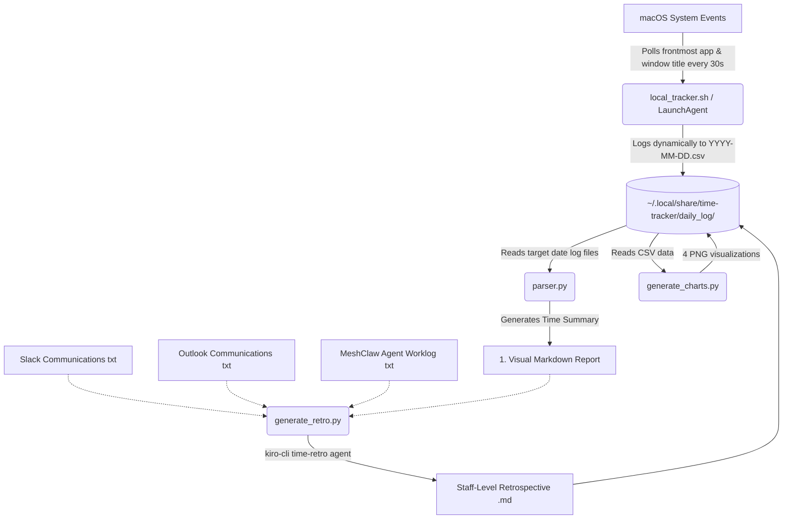

# Private Air-Gapped Time-Tracking System
## Architectural & Implementation Specification

This specification outlines the architecture, configuration, and operation of a 100% private, air-gapped time-tracking system designed for environments with strict corporate info-sec constraints. 

By splitting the task into deterministic data collection (Bash/AppleScript), lightweight mathematical aggregation (Python/Pandas), and qualitative semantic analysis (local LLM), this system ensures that sensitive activity metrics never leave your local workspace.

---

## 🏗️ System Architecture


```mermaid
graph TD
    A[macOS System Events] -->|Polls frontmost app & window title every 30s| B(local_tracker.sh / LaunchAgent)
    B -->|Logs dynamically to YYYY-MM-DD.csv| C[(~/.local/share/time-tracker/daily_log/)]
    C -->|Reads target date log files| D(parser.py)
    D -->|Generates Time Summary| E[1. Visual Markdown Report]
    C -->|Reads CSV data| K(generate_charts.py)
    K -->|4 PNG visualizations| C
    
    H[Slack Communications txt] -.-> L
    I[Outlook Communications txt] -.-> L
    G[MeshClaw Agent Worklog txt] -.-> L
    E -.-> L
    
    L(generate_retro.py) -->|kiro-cli time-retro agent| J[Staff-Level Retrospective .md]
    J --> C
```

### Key Highlights
* **Zero Data Exfiltration**: Runs completely within the local CPU/GPU and storage boundaries. The only network call is to the kiro-cli LLM agent for retrospective synthesis.
* **Cross-Device Syncing**: The parser aggregates all logs for a target date (e.g., `YYYY-MM-DD_home.csv` and `YYYY-MM-DD_office.csv`), making it seamless to track time across multiple laptops by archiving CSVs into the shared log folder.
* **Rich Visual Reports**: `generate_charts.py` outputs 4 PNG visualizations; `parser.py` generates a Markdown report with app/domain breakdowns.
* **Automated Retrospective**: `generate_retro.py` synthesizes quantitative data + communication logs into a Staff-level daily retrospective via `kiro-cli`.
* **Deterministic Arithmetic**: Offloads statistical aggregation to Python/Pandas instead of relying on the LLM's weak arithmetic capabilities.
* **Defined Storage Path**: Daily logs are stored at `~/.local/share/time-tracker/daily_log/`. A symlink at `~/Documents/Projects/time_tracker/daily_log` provides project-level access.
* **Daily Log Rotation**: The logging script dynamically switches to a new file named `YYYY-MM-DD.csv` at midnight, eliminating the need for a separate log rotation daemon.
* **Minimal Resource Footprint**: The background bash tracker sleeps between polls, consuming near-zero CPU cycles.
* **Persistent via LaunchAgent**: `com.neeravk.time-tracker.plist` starts the tracker on login and restarts it if killed.

### File Layout
```
~/Documents/Projects/time_tracker/       # Project scripts (Kiro workspace)
├── local_tracker.sh                     # Reference logger script
├── parser.py                            # Quantitative report generator
├── generate_charts.py                   # PNG visualization generator
├── generate_retro.py                    # LLM retrospective generator
└── daily_log -> ~/.local/share/time-tracker/daily_log/  # Symlink

~/.local/share/time-tracker/daily_log/   # Actual data storage
├── YYYY-MM-DD.csv                       # Raw activity log (auto-generated)
├── YYYY-MM-DD_report.md                 # Parser output (generated)
├── YYYY-MM-DD_retrospective.md          # LLM retrospective (generated)
├── YYYY-MM-DD_active_minutes.png        # Chart (generated)
├── YYYY-MM-DD_context_switches.png      # Chart (generated)
├── YYYY-MM-DD_app_time.png              # Chart (generated)
├── YYYY-MM-DD_chrome_domains.png        # Chart (generated)
└── YYYY-MM-DD_*.txt                     # Supplementary inputs (see below)

~/.local/bin/time-tracker                # Active logger (used by LaunchAgent)
~/.kiro/agents/time-retro.json           # Kiro agent for retro synthesis
~/Library/LaunchAgents/com.neeravk.time-tracker.plist  # Auto-start
```

---

## 🛠️ Implementation Details & Code Reference

To implement this system, create the following files in your preferred local environment directory.

### 1. Passive macOS Window Capture (`local_tracker.sh`)
This background shell script polls macOS system events every 30 seconds to capture the active application, window title, and active browser tab URL. It dynamically creates and writes to a new log file named after the current date (`YYYY-MM-DD.csv`).

```bash
#!/bin/zsh

# Configurable polling interval in seconds
POLL_INTERVAL=30

# DEFINED STORAGE PATH: Directory where daily log CSVs are stored
LOG_DIR="$HOME/.local/share/time-tracker/daily_log"

# Ensure the log directory exists
mkdir -p "$LOG_DIR"

echo "Starting passive macOS Window Tracker (polling every ${POLL_INTERVAL}s)..."
echo "Daily logs will be written to: $LOG_DIR"
echo "Press Ctrl+C to stop (if running in foreground)."

while true; do
    # Dynamically determine the log file name based on the current date (e.g. 2026-05-24.csv)
    CURRENT_DATE=$(date +"%Y-%m-%d")
    LOG_FILE="$LOG_DIR/${CURRENT_DATE}.csv"
    
    # Initialize CSV header only if the file doesn't already exist
    if [ ! -f "$LOG_FILE" ]; then
        echo "Timestamp,Application,WindowTitle,URL" > "$LOG_FILE"
    fi

    # Capture frontmost app name and window title via AppleScript (always compiles cleanly)
    APP_INFO=$(osascript -e '
        tell application "System Events"
            set frontApp to first application process whose frontmost is true
            set appName to name of frontApp
            try
                tell frontApp to set winName to name of first window
            on error
                set winName to "No Active Window"
            end try
            return appName & "%%" & winName
        end tell' 2>/dev/null)

    if [ ! -z "$APP_INFO" ]; then
        TIMESTAMP=$(date +"%Y-%m-%d %H:%M:%S")
        
        # Split the string by the delimiter
        APP_NAME=$(echo "$APP_INFO" | awk -F '%%' '{print $1}')
        WIN_TITLE=$(echo "$APP_INFO" | awk -F '%%' '{print $2}')
        
        # Skip logging lock screen, login window, and screensaver events
        if [[ "$APP_NAME" == "loginwindow" || "$APP_NAME" == "ScreenSaverEngine" || "$APP_NAME" == "SecurityAgent" ]]; then
            sleep "$POLL_INTERVAL"
            continue
        fi
        
        # Capture active tab URL dynamically depending on the active browser
        TAB_URL="N/A"
        if [ "$APP_NAME" = "Google Chrome" ]; then
            TAB_URL=$(osascript -e 'tell application "Google Chrome" to get URL of active tab of front window' 2>/dev/null)
        elif [ "$APP_NAME" = "Safari" ]; then
            TAB_URL=$(osascript -e 'tell application "Safari" to get URL of current tab of front window' 2>/dev/null)
        elif [ "$APP_NAME" = "Arc" ]; then
            TAB_URL=$(osascript -e 'tell application "Arc" to get URL of active tab of front window' 2>/dev/null)
        elif [ "$APP_NAME" = "Brave Browser" ]; then
            TAB_URL=$(osascript -e 'tell application "Brave Browser" to get URL of active tab of front window' 2>/dev/null)
        elif [ "$APP_NAME" = "Microsoft Edge" ]; then
            TAB_URL=$(osascript -e 'tell application "Microsoft Edge" to get URL of active tab of front window' 2>/dev/null)
        fi
        
        # Default empty/null URL to N/A
        if [ -z "$TAB_URL" ]; then
            TAB_URL="N/A"
        fi
        
        # Sanitize double quotes for clean CSV writing (double quote escaping)
        APP_NAME="${APP_NAME//\"/\"\"}"
        WIN_TITLE="${WIN_TITLE//\"/\"\"}"
        TAB_URL="${TAB_URL//\"/\"\"}"

        # Append structured row to the CSV log file
        echo "\"$TIMESTAMP\",\"$APP_NAME\",\"$WIN_TITLE\",\"$TAB_URL\"" >> "$LOG_FILE"
    fi
    
    sleep "$POLL_INTERVAL"
done
```

---

### 2. Deterministic Aggregator (`parser.py`)
This Python script aggregates a target date's log file. It defaults to analyzing today's logs, but accepts a specific date (format: `YYYY-MM-DD`) as a command-line argument.

```python
import os
import sys
import glob
import datetime
from urllib.parse import urlparse
import pandas as pd
import numpy as np
import matplotlib.pyplot as plt
import seaborn as sns

# DEFINED STORAGE PATH: Directory where daily log CSVs are stored
LOG_DIR = os.path.join(os.path.expanduser("~"), ".local/share/time-tracker/daily_log")

# Polling interval in seconds used in local_tracker.sh
# 30 seconds = 0.5 minutes per record
POLL_INTERVAL_SECONDS = 30
MINUTES_PER_RECORD = POLL_INTERVAL_SECONDS / 60.0

def extract_domain(url):
    if not isinstance(url, str) or pd.isna(url) or url.strip() in ('N/A', ''):
        return 'N/A'
    try:
        if not url.startswith(('http://', 'https://', 'file://', 'chrome://', 'about:')):
            url = 'https://' + url
        parsed = urlparse(url)
        domain = parsed.netloc
        if domain.startswith('www.'):
            domain = domain[4:]
        return domain if domain else 'N/A'
    except Exception:
        return 'N/A'

def main():
    if len(sys.argv) > 1:
        target_date = sys.argv[1]
    else:
        target_date = datetime.date.today().strftime("%Y-%m-%d")

    log_files = glob.glob(os.path.join(LOG_DIR, f"{target_date}*.csv"))

    if not log_files:
        print(f"Error: No log files for date '{target_date}' found in {LOG_DIR}", file=sys.stderr)
        sys.exit(1)

    df_list = []
    for log_file in log_files:
        try:
            temp_df = pd.read_csv(log_file)
            df_list.append(temp_df)
        except pd.errors.EmptyDataError:
            continue
        except Exception as e:
            print(f"Error reading {log_file}: {e}", file=sys.stderr)
            
    if not df_list:
        print(f"Warning: Log files for {target_date} are empty or invalid.", file=sys.stderr)
        sys.exit(0)
        
    df = pd.concat(df_list, ignore_index=True)

    if df.empty:
        print(f"No log data recorded for {target_date} yet.")
        sys.exit(0)

    df.columns = df.columns.str.strip()

    if 'URL' not in df.columns:
        df['URL'] = 'N/A'

    df['Minutes'] = MINUTES_PER_RECORD

    lock_screen_apps = ['loginwindow', 'ScreenSaverEngine', 'SecurityAgent']
    df = df[~df['Application'].isin(lock_screen_apps)]

    # Filter out idle/empty window records
    df = df[df['WindowTitle'] != 'No Active Window']

    df['Domain'] = df['URL'].apply(extract_domain)

    app_summary = df.groupby('Application')['Minutes'].sum().sort_values(ascending=False)

    browser_df = df[df['Domain'] != 'N/A']
    domain_summary = browser_df.groupby('Domain')['Minutes'].sum().sort_values(ascending=False).head(10)

    top_windows = df.groupby(['Application', 'WindowTitle'])['Minutes'].sum().reset_index()
    top_windows = top_windows.sort_values(by='Minutes', ascending=False).head(20)

    print("=" * 45)
    print(f"=== DAILY TIME BREAKDOWN FOR {target_date} ===")
    print("=" * 45)
    print(app_summary.to_string())
    
    if not domain_summary.empty:
        print("\n" + "=" * 45)
        print("=== TOP WEB DOMAINS (MINUTES) ===")
        print("=" * 45)
        print(domain_summary.to_string())

    print("\n" + "=" * 45)
    print("=== TOP SPECIFIC CONTEXTS ===")
    print("=" * 45)
    print(top_windows.to_string(index=False))

    slack_file = os.path.join(LOG_DIR, f"{target_date}_slack.txt")
    outlook_file = os.path.join(LOG_DIR, f"{target_date}_outlook.txt")
    
    if os.path.exists(slack_file):
        print("\n" + "=" * 45)
        print("=== SLACK MESSAGES SUMMARY ===")
        print("=" * 45)
        with open(slack_file, 'r') as f:
            print(f.read().strip())
            
    if os.path.exists(outlook_file):
        print("\n" + "=" * 45)
        print("=== OUTLOOK SENT MESSAGES SUMMARY ===")
        print("=" * 45)
        with open(outlook_file, 'r') as f:
            print(f.read().strip())

    # --- Generate Visualizations and Markdown Report ---
    try:
        df['Timestamp'] = pd.to_datetime(df['Timestamp'])
        df = df.sort_values('Timestamp')
        df['Hour'] = df['Timestamp'].dt.hour
        
        hourly_active = df.groupby('Hour').size() * MINUTES_PER_RECORD
        
        df['prev_app'] = df['Application'].shift(1)
        df['prev_title'] = df['WindowTitle'].shift(1)
        switches = (df['Application'] != df['prev_app']) | (df['WindowTitle'] != df['prev_title'])
        switches.iloc[0] = False
        hourly_switches = df[switches].groupby('Hour').size()
        
        hours = np.arange(24)
        active_arr = np.zeros(24)
        switch_arr = np.zeros(24)
        for h, v in hourly_active.items():
            active_arr[h] = v
        for h, v in hourly_switches.items():
            switch_arr[h] = v
            
        sns.set_theme(style="whitegrid")
        
        plt.figure(figsize=(10, 5))
        plt.bar(hours, active_arr, color='#4c72b0')
        plt.xlabel('Hour of Day (24h)')
        plt.ylabel('Active Minutes')
        plt.title(f'Active Minutes per Hour - {target_date}')
        plt.xticks(hours)
        plt.tight_layout()
        active_img_path = os.path.join(LOG_DIR, f"{target_date}_active_minutes.png")
        plt.savefig(active_img_path)
        plt.close()
        
        plt.figure(figsize=(10, 5))
        plt.bar(hours, switch_arr, color='#dd8452')
        plt.xlabel('Hour of Day (24h)')
        plt.ylabel('Number of Context Switches')
        plt.title(f'Context Switches per Hour - {target_date}')
        plt.xticks(hours)
        plt.tight_layout()
        switch_img_path = os.path.join(LOG_DIR, f"{target_date}_context_switches.png")
        plt.savefig(switch_img_path)
        plt.close()
        
        md_content = f"# 📊 Time Tracking & Workflow Analysis - {target_date}\n\n"
        md_content += "## ⏱️ Active Minutes by Hour\n"
        md_content += f"\n\n"
        md_content += "## 🔀 Context Switching Analysis\n"
        md_content += f"\n\n"
        
        md_content += "## 💻 App Breakdown\n```text\n"
        md_content += app_summary.to_string() + "\n```\n\n"
        
        if not domain_summary.empty:
            md_content += "## 🌐 Top Web Domains\n```text\n"
            md_content += domain_summary.to_string() + "\n```\n\n"
            
        md_content += "## 🔍 Top Specific Contexts\n```text\n"
        md_content += top_windows.to_string(index=False) + "\n```\n\n"
        
        if os.path.exists(slack_file):
            md_content += "## 💬 Slack Messages\n```text\n"
            with open(slack_file, 'r') as f:
                md_content += f.read().strip() + "\n```\n\n"
                
        if os.path.exists(outlook_file):
            md_content += "## 📧 Outlook Sent Messages\n```text\n"
            with open(outlook_file, 'r') as f:
                md_content += f.read().strip() + "\n```\n\n"
                
        report_path = os.path.join(LOG_DIR, f"{target_date}_report.md")
        with open(report_path, 'w') as f:
            f.write(md_content)
            
        print(f"\n[+] Successfully generated visual Markdown report at: {report_path}")
        
    except Exception as e:
        print(f"\n[-] Failed to generate visualizations/markdown: {e}", file=sys.stderr)

if __name__ == "__main__":
    main()
```

---

### 3. Local LLM Context Synthesis Prompt
Use this template in your local LLM engine. Paste the stdout from `parser.py` alongside your other qualitative daily summaries.

```text
# SYSTEM INSTRUCTIONS
You are an executive engineering coach specializing in the productivity and career growth of Staff-level Data Engineers. You are highly analytical, direct, and focused on maximizing architectural impact over busywork.

# INPUT DATA
Review the attached files capturing my workday. Cross-reference the quantitative time data with the qualitative summaries of my communications and research. The attachments include:
1. A quantitative time-tracking summary.
2. A summary of my LLM agent interactions.
3. A summary of my Slack communications.
4. A summary of my Outlook communications.

# OUTPUT REQUIREMENTS
Based strictly on the data in the attached files, generate an end-of-day retrospective. Do not include conversational filler or introductory text. Output in standard Markdown using the following structure:

## 1. Context & Focus Analysis
Synthesize the time-tracking data with my actual outputs. Did my deep-work time (IDEs, LLM research) produce meaningful architectural progress? Cross-reference my Slack and Outlook time with the actual messages sent—was this time spent on Staff-level unblocking, mentoring, and system design, or was it hijacked by reactive, low-level troubleshooting? 

## 2. The Eisenhower Mapping
Map my actual deliverables, communications, and research topics against the Eisenhower Matrix.
*   **Urgent & Important:** Critical path unblocking, production incidents, key architectural decisions made today.
*   **Important but Not Urgent:** Deep system design, LLM research, strategic code refactoring, and documentation.
*   **Urgent but Not Important:** Routine Slack threads, ad-hoc questions, and standard emails.
*   **Not Urgent & Not Important:** Pure friction, context switching, unrelated browsing.

## 3. Tomorrow's Standup Update
Draft a concise, 3-bullet standup update summarizing today's actual focus. Use the qualitative summaries (Slack, Outlook, LLM interactions) to specify exactly what was researched or resolved. Use strong, Staff-level action verbs (e.g., architected, synthesized, unblocked, decoupled, orchestrated). Focus on the business and technical impact of the work.
```

---

## 🚀 Setup & Execution Guide

### Step 1: Running the Logger
The tracker runs as a macOS LaunchAgent that starts on login and auto-restarts if killed.

**Installation:**
1. The script lives at `~/.local/bin/time-tracker` (copy of `local_tracker.sh` with the correct `LOG_DIR`).
2. The LaunchAgent plist is at `~/Library/LaunchAgents/com.neeravk.time-tracker.plist`.
3. Load it:
   ```bash
   launchctl load ~/Library/LaunchAgents/com.neeravk.time-tracker.plist
   ```
4. To stop temporarily:
   ```bash
   launchctl unload ~/Library/LaunchAgents/com.neeravk.time-tracker.plist
   ```

**macOS Security Settings**:
> [!IMPORTANT]
> The first time you run this, macOS will ask to grant Terminal (or the parent process) **Accessibility** permissions under *System Settings > Privacy & Security > Accessibility*. This is required for AppleScript to query window titles and active browser tabs.

### Step 2: Running the Parser
1. Save the python code as `parser.py`.
2. Ensure you have the `pandas` library installed:
    ```bash
    pip install pandas matplotlib seaborn numpy
    ```
3. Run the script at the end of the day to parse today's logs:
   ```bash
   python parser.py
   ```
4. To parse logs for a previous day, supply the date as an argument:
   ```bash
   python parser.py 2026-05-23
   ```

### Step 3: Generating Charts
```bash
python generate_charts.py [DATE]
```
Outputs 4 PNG visualizations into the daily_log directory:
- `{date}_active_minutes.png` — bar chart of active minutes per hour
- `{date}_context_switches.png` — bar chart of context switches per hour
- `{date}_app_time.png` — horizontal bar of time per application
- `{date}_chrome_domains.png` — treemap-style breakdown of Chrome time by domain

### Step 4: Generating the Retrospective
```bash
python generate_retro.py [DATE]        # generates retro from existing report + comms files
python generate_retro.py --full [DATE]  # runs parser + charts + retro end-to-end
```
The retrospective script:
1. Reads the `_report.md` and **all** `{date}_*.txt` supplementary files for the target date.
2. Loads up to 3 prior days' retrospectives for week-pattern comparison.
3. Sends all data to the `time-retro` kiro-cli agent (lightweight, no MCP servers).
4. Saves the output as `{date}_retrospective.md` in the daily_log.

**Prerequisite**: The `time-retro` kiro-cli agent must be configured at `~/.kiro/agents/time-retro.json`.

### Supplementary Input Files Convention

Both `parser.py` and `generate_retro.py` **dynamically discover** all `.txt` files matching the pattern `{date}_{source}.txt` in the daily_log directory. There is no hardcoded list of sources.

**To add a new input source**, simply drop a file named `YYYY-MM-DD_{source}.txt` into the daily_log folder. It will automatically be:
- Printed to stdout by `parser.py` (under the heading `=== {SOURCE} ===`)
- Included in the `_report.md` (under `## {Source}`)
- Fed to the LLM for retrospective synthesis (under `# {Source}`)

**Current known sources:**
| Filename suffix | Content |
|----------------|---------|
| `_slack.txt` | Slack channel/DM activity summary |
| `_outlook.txt` | Outlook sent messages summary |
| `_meshclaw.txt` | MeshClaw AI agent worklog |
| `_sim.txt` | SIM tickets / sprint board updates |

**Adding new sources (examples):**
| Filename suffix | Content |
|----------------|---------|
| `_github.txt` | GitHub PR/review activity |
| `_oncall.txt` | On-call incident notes |
| `_meetings.txt` | Meeting notes/decisions |
| `_research.txt` | Technical research summary |
| `_kiro.txt` | Kiro agent interaction logs |

No code changes are required — just create the file and the pipeline picks it up.

---

## 🔒 Architectural Decisions & Design Notes

### Defined Storage Path & Log Rotation
* **Defined Path**: Daily logs are stored under `~/.local/share/time-tracker/daily_log/`. The project directory (`~/Documents/Projects/time_tracker/`) contains scripts and a symlink `daily_log -> ~/.local/share/time-tracker/daily_log/` for convenient access.
* **Why ~/.local/share**: macOS sandboxes LaunchAgent access to `~/Documents/`. Storing logs outside the protected folder ensures the background tracker can write without Full Disk Access permissions.
* **Automatic Log Rotation**: Every iteration, the script dynamically gets the current date and sets `LOG_FILE="$LOG_DIR/${CURRENT_DATE}.csv"`. When midnight passes, the script automatically begins logging to the new file (e.g. `2026-05-25.csv`), leaving the previous day's log complete and untouched.

### Handling Screen Lock & Sleep States
* **Screen Lock (Mac Awake)**: When the screen is locked but the Mac is awake, macOS makes `loginwindow`, `ScreenSaverEngine`, or `SecurityAgent` the active window context. The system automatically ignores these events:
  * **Logger level**: `local_tracker.sh` skips appending these records to the CSV to avoid log pollution.
  * **Parser level**: `parser.py` filters these application names from historical data as a fallback to keep metrics accurate.
* **Lid Closed (Sleep Mode)**: When you close the lid, macOS suspends all user-space processes (including the shell tracker script). Logging automatically pauses without any CPU consumption, and resumes immediately when you open the lid. No manual start/stop is required at the end of the day.

### Browser Tab Tracking & Domain Extraction
The tracker automatically queries the active browser's window or tab to retrieve the active tab URL.
* **Supported Browsers**: Google Chrome, Safari, Arc, Brave Browser, and Microsoft Edge.
* **Non-Supported Browsers**: Browsers like Firefox do not expose the active URL via standard AppleScript interface and will default the URL capture to `N/A` (while still logging the window title).
* **Domain Aggregation**: The parser automatically extracts the top-level domain from the captured URL (e.g. mapping `https://github.com/pulls` to `github.com`) and reports the **Top Web Domains** visited, making it easy to identify time spent on documentation, reference material, code repositories, or messaging apps.

### Ignoring Specific Applications
If you wish to auto-ignore other apps (e.g., Spotify) so they don't appear in your work log, you can add a filter condition to `local_tracker.sh`:
```bash
# Add this filter inside the while loop in local_tracker.sh:
if [[ "$APP_NAME" == "Spotify" ]]; then
    sleep "$POLL_INTERVAL"
    continue
fi
```

---

## 🔒 InfoSec Compliance Note
1. No telemetry or keystrokes are logged.
2. Only frontmost window names are captured; no browser content, cookies, or actual file contents are read.
3. The LLM retrospective uses `kiro-cli` (Amazon internal tool) — data stays within the corporate boundary. No external APIs are called.
4. All raw data (CSVs, communication summaries) remains on the local filesystem.
